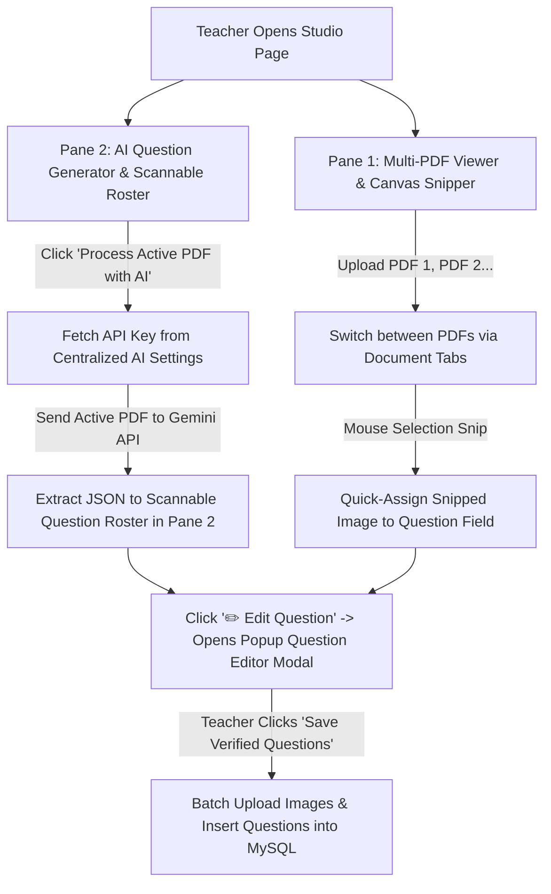

# Implementation Plan — AI & PDF Question Studio (Single Upload, Multi-PDF Tabs, Centralized Settings & Popup Editor)

This plan details the updated user experience and React architecture for **`AI & PDF Question Studio`**.

---

## 🎨 Master Studio Layout & Workflow

---

## 🛠️ Detailed Component & UX Specification

### 1. Pane 1 (Left): Multi-PDF Document Workspace & Snipping Canvas
- **Multi-PDF Document Selector**:
  - Top tab bar: `📄 Paper_2025.pdf ✖` | `📄 Practice_Set_2.pdf ✖` | `➕ Add PDF`.
  - Teachers can load multiple documents into Pane 1 and switch between them instantly.
- **Canvas Snipper**:
  - Drag mouse on PDF page canvas to crop any diagram/table/equation.
  - Floating Quick-Assign menu injects the snipped image directly into target question fields (*Passage*, *Question*, *Option A–F*, *Explanation*).

### 2. Pane 2 (Right): AI Trigger & Scannable Question Cards
- **Single AI Action Bar**:
  - Button: **`🤖 Process Active PDF with AI`** (Page range selector: *All Pages*, *Page 1*, *Pages 1–5*).
  - Uses the active PDF loaded in Pane 1. Zero duplicate file uploads required!
- **Scannable Question Roster**:
  - Compact, scannable list of extracted questions.
  - Displays Question Index, English/Hindi snippet, options, attached image thumbnails, and verification badges (`Verified` / `Needs Review`).
  - Action buttons per card: **`✏️ Edit & Verify`**, **`🗑️ Delete`**, **`📋 Duplicate`**.

### 3. Centralized AI API Key Settings Page
- Key stored in **Settings Page** under **"🤖 AI Engine Configuration"**:
  - Supported Providers: **Google Gemini (Recommended - Free & Fast)**, OpenAI GPT-4o.
  - Encrypted storage in `localStorage` or institute settings table.
- **In-Studio Instruction Banner**:
  - If no API key is configured, Pane 2 displays an informative callout banner:
    > *"⚠️ AI Key Required: Please add your Gemini API Key in Settings to enable AI PDF Auto-Extraction."*
    > *Step 1: Get a free key at [aistudio.google.com](https://aistudio.google.com).*  
    > *Step 2: Click [⚙️ Configure AI Key in Settings] to paste key.*

### 4. Popup Question Editor Modal (`QuestionEditorModal.jsx`)
- Clicking **`✏️ Edit & Verify`** opens a spacious popup modal:
  - Rich bilingual text inputs (English / Hindi).
  - Dynamic 2 to 6 Options builder with correct answer radio buttons.
  - Thumbnail Cards for attached images with **"🗑️"** remove buttons.
  - Live real-time KaTeX math rendering preview.

### 5. Deferred Database Saving
- Snipped images remain in browser memory as local Blob URLs (`URL.createObjectURL(blob)`).
- Questions and images are uploaded to `/images/upload` and inserted into MySQL `question_bank` **only when clicking "Save Verified Questions"**.

---

## User Review Required

> [!IMPORTANT]
> **Key UX Approvals**:
> 1. **No Duplicate PDF Upload**: Pane 1 handles PDF document management & tab switching; Pane 2 automatically reads the active PDF from Pane 1 for AI processing.
> 2. **Centralized Settings for AI Key**: API key is managed in Settings with clear instructions on getting a free Google Gemini key.
> 3. **Popup Editor Modal**: Keeps Pane 2 clean and scannable while giving a full modal popup for detailed question editing.

---

## Proposed Changes

### React Components (`src/components/ai-studio/`)
- **`AiPdfStudioApp.jsx`**: Main Studio workspace layout.
- **`PdfMultiViewerCanvas.jsx`**: Multi-PDF tab switcher & canvas snipper (Pane 1).
- **`AiQuestionRoster.jsx`**: AI trigger bar & scannable question list (Pane 2).
- **`QuestionEditorModal.jsx`**: Rich popup modal for detailed question editing.
- **`AiSettingsTab.jsx`**: AI Key settings component for Settings View.

---

## Verification Plan

### Automated Verification
- Run `npm run build` to verify React JSX compilation and module bundling.

### Manual Verification
1. **Multi-PDF Tab Test**: Load 2 PDFs in Pane 1 ➔ verify tab switching and canvas rendering.
2. **AI Settings Test**: Click **Configure AI Key** ➔ confirm redirection to Settings ➔ save Gemini key.
3. **AI Process Test**: Click **Process Active PDF with AI** in Pane 2 ➔ confirm AI extracts questions from Pane 1's PDF without re-uploading.
4. **Popup Editor Test**: Click **Edit & Verify** on a question card ➔ verify popup modal opens with KaTeX preview.
5. **Deferred Save Test**: Click **Save Verified Questions** ➔ verify batch image uploads and MySQL insertion.
